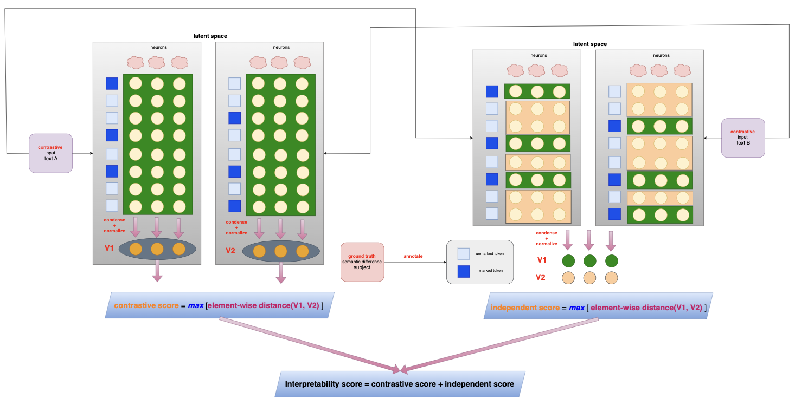
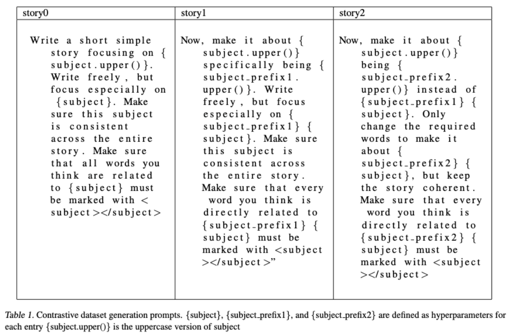
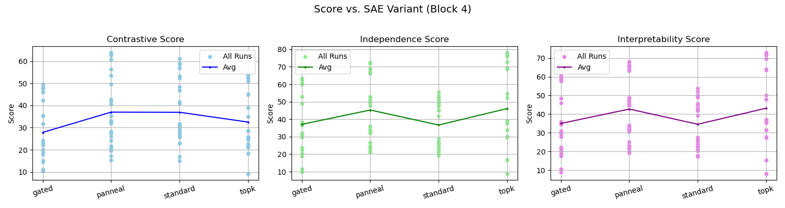
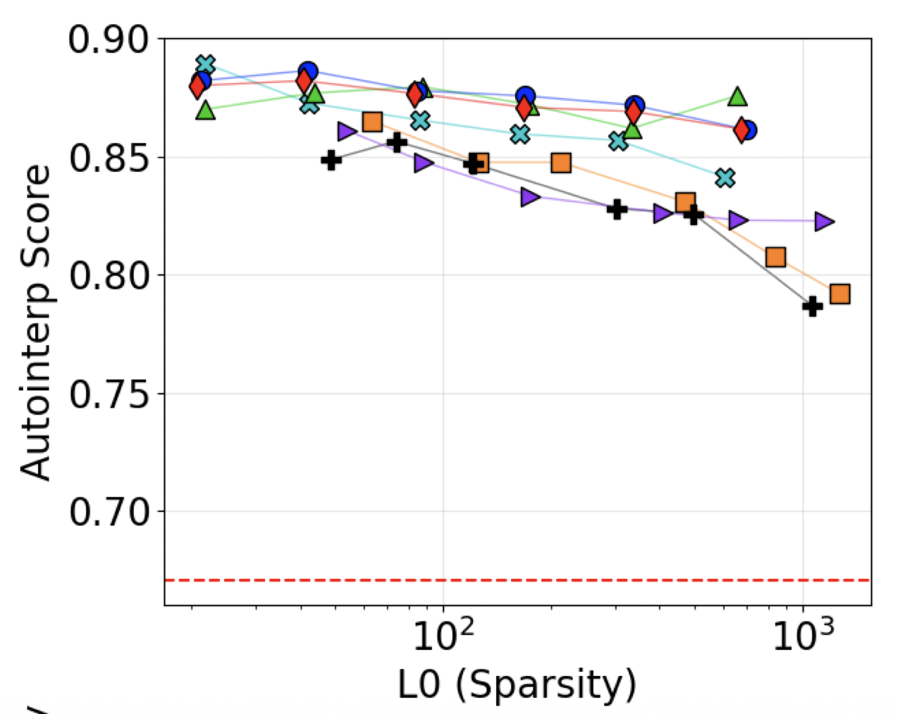
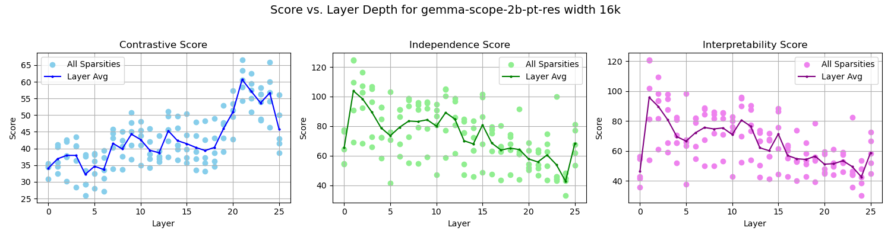
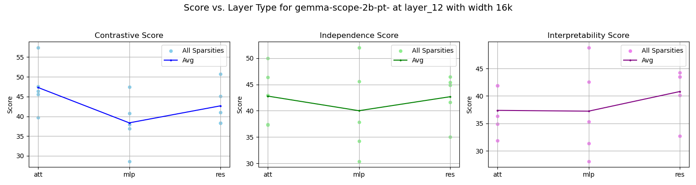
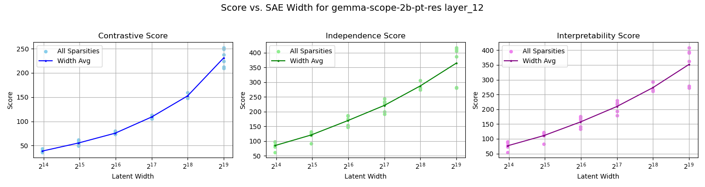

# CE-Bench: A Contrastive Evaluation Benchmark of LLM Interpretability with Sparse Autoencoders

Authors: Alex Gulko, Yusen Peng; Advisor: Dr. Sachin Kumar

## Motivation
The two existing interpretability evaluation methods are based on LLM prompting, which can be inherently nondeterministic, unstable, and inconsistent, despite the fact that we can run the same prompt multiple times to slightly alleviate this problem. Instead of utilizing any LLM to evaluate or simulate neuron activations, we propose a contrastive evaluation framework, CE-Bench. Its architecture is illustrated below:

## Contrastive Dataset
we first constructed a contrastive dataset, consisting of entries each with 3 stories and a subject. Stories are generated synthetically using GPT-4o LLM based on the subject and two prefixes with the prompts specified below.

## Contrastive Score
We hypothesize that if neurons activate more differently between tokens with contrastive meanings between two contrastive paragraphs, the latent space is more interpretable. On the left side of the architecture, to implement this, for both input paragraphs, we compute the average activations of all tokens and jointly normalize them as well. We take the absolute element-wise difference of the average activations of two contrastive paragraphs, and we assign the maximum element-wise difference as the contrastive score.

## Independent Score
We also hypothesize that if neurons activate more differently between marked tokens and unmarked tokens regardless of in which paragraph they are, the latent space is more interpretable. On the left side of the architecture, to realize this, for both paragraphs, we compute the average activations of marked tokens and the average activations of unmarked tokens, then jointly normalize them. We take the absolute element-wise difference between the activations of marked tokens and unmarked tokens, and we assign the maximum element-wise difference as the independent score.

## Interpretability Score
we also hypothesize that the simple summation of them can be a naive yet reasonable indicator of the interpretability of sparse autoencoder probing: interpretable neurons, or interpretable sparse autoencoders as a whole, should demonstrate both strong contrastivity and independence.

## Benchmark Result Analysis

### Architecture of Sparse Autoencoders

### our result (preliminary):

SAE suite: sae_bench_pythia70m

### SAEBench result:

SAE suite: 65k width Gemma-2-2B

### Depth of Layers

SAE suite: 16k gemma-scope-2b-pt-res

### Type of Layers

### our result (preliminary)

### Width of Latent Space

### our result (preliminary):

## Steering Result Analysis

| metric | # top neurons | scale | steering evaluation |
| ------ | ---------- | ---- | ---------------- |
| interpretability | 5 | 10 | TBD |
| contrastive | 5 | 10 | TBD |
| independent | 5 | 10 | TBD |

## command zoo

cores python ce_bench/CE_Bench.py --sae_regex_pattern "gemma-scope-2b-pt-res" --sae_block_pattern "layer_12/width_16k/average_l0_.*"

cores python ce_bench/neuron_steering.py
