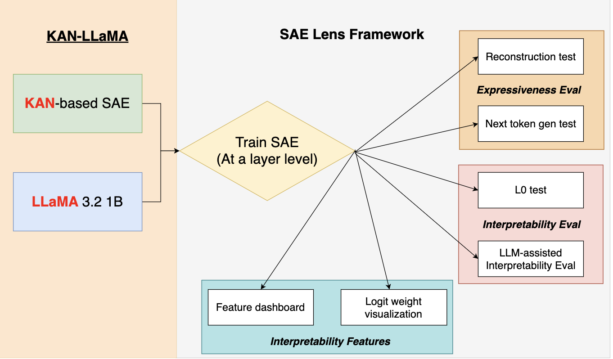

# KAN-LLaMA: An Interpretable Large Language Model With KAN-based Sparse Autoencoders

## CSE 5525 Final Project @ The Ohio State University

## Authors: Alex Gulko, Yusen Peng

## Project check-in task-list

### preliminary exploration

1. actually train an SAE on Llama 3.2 1B (prototype done)
    now we are able to train a SAE upon Llama 3.2 1B with the dataset "apollo-research/roneneldan-TinyStories-tokenizer-gpt2" using only 1M tokens;
    now we have "standard", "gated", "topk", "jumprelu" trained!
    
2. analyze the trained SAE for Llama 3.2 1B: L0 test (prototype done)
    now we are able to extract average L0 scores for every single batch and put them into a CSV fle (dataset is NeelNanda/pile-10k downsampling 400);
   
    A lower L0 score generally means a more interpretable model because it enforces sparsity, isolating distinct features, reducing redundancy, and improving tractability.

    now we have trained "standard", "gated", "topk", "jumprelu" L0 scores!

3. expressiveness evaluation: reconstruction test/zero ablation test (prototype done)
    now we are able to generate original loss, reconstruction loss, and zero ablation loss in a single csv file/
    
    so far we have reconstruction error for "standard", "gated", "topk", "jumprelu"!

4. expressiveness evaluation: specific capability test (prototype done)
    Specific capability test compares model's capability on a next token generation task without SAE and with SAE. The outputs are written into log files accordingly. now we have "standard", "gated", "topk", "jumprelu" log files! 

5. interpretability features: Logits Lens (prototype done)
    now we are able to derive three plots per activation architecture. Kurtosis represents outliers and activation stability; Skewness represents asymmetry in neural representations; Skewness vs. Kurtosis can show feature specialization and learning dynamics. now we have plots for all "standard", "gated", "topk", "jumprelu"!

6. interpretability features: SAE feature dashboard (prototype done)
    we are able to generate feature dashboard in HTML, including neuron alignment, activation density, correlated features, and top activations, etc. for now we have HTML output for all "standard", "gated", "topk", "jumprelu" sparse autoencoders!

## interpretability evaluation

inspired by "Route Sparse Autoencoder to Interpret Large Language Models", we use a similar LLM-Assisted interpretability evaluation benchmark with some prompt engineering. Following the LLM-assisted approach above can make the interpretability evaluation much simpler. 

Right now, the basic pipeline with ChatGPT-4o is working; we can get interpretability scores saved in a csv file for each SAE.

## KAN autoencoder integration

this is the challenging part: stay tuned!
