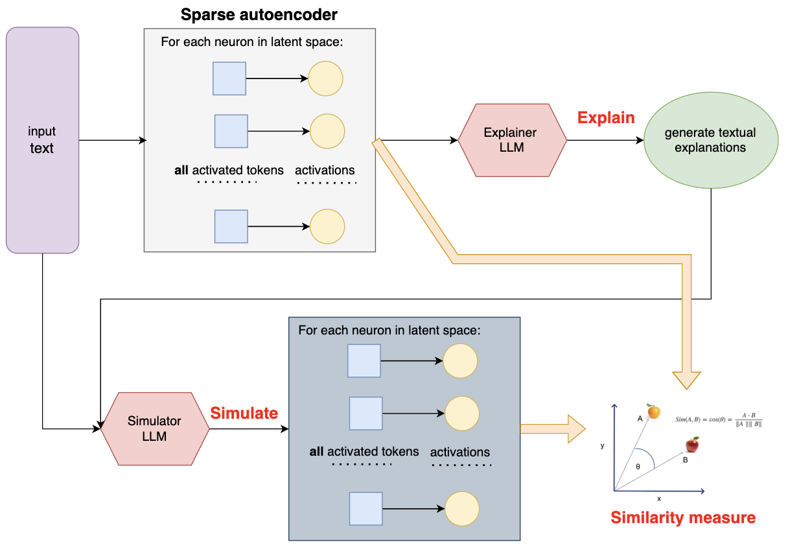
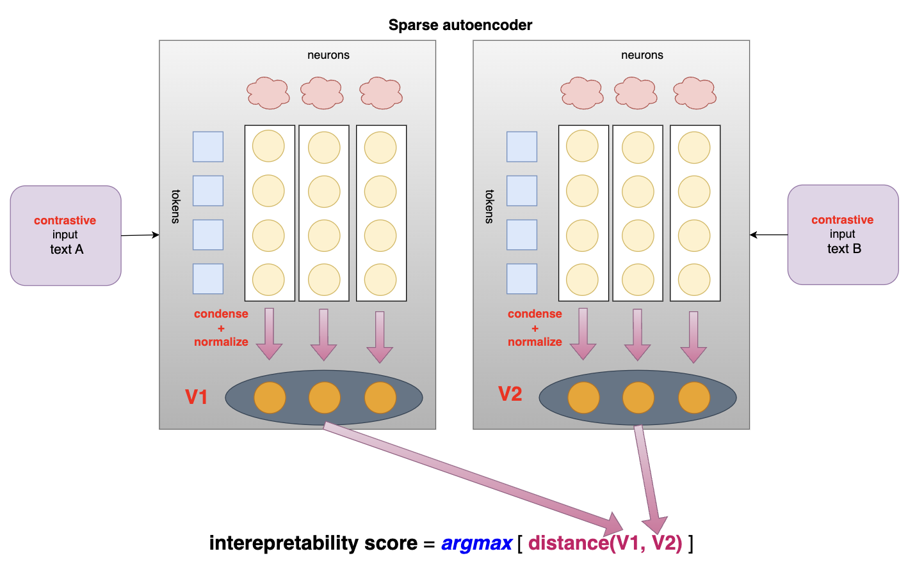

# KAN-LLaMA: An Interpretable Large Language Model With KAN-based Sparse Autoencoders

## CSE 5525 Final Project @ The Ohio State University under Dr. Sachin Kumar

## Authors: Alex Gulko, Yusen Peng

