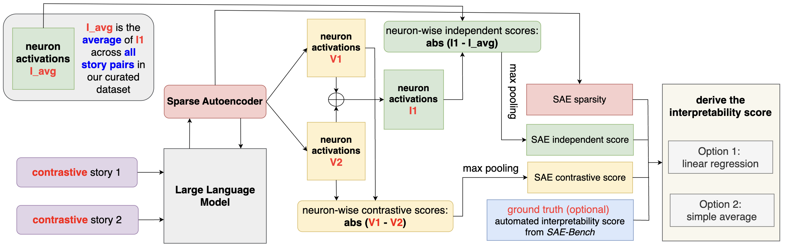

# CE-Bench: A Contrastive Evaluation Benchmark of LLM Interpretability with Sparse Autoencoders

Alex Gulko*, Yusen Peng*, Sachin Kumar

## News

- [September 18th, 2025] paper accepted at BlackboxNLP Workshop @ EMNLP, 2025! See you in Suzhou, China!
- [August 31, 2025] paper available on [arXiv](https://arxiv.org/abs/2509.00691)!
- [May 15, 2025] contrastive story dataset is publicly available on [HuggingFace](https://huggingface.co/datasets/GulkoA/contrastive-stories-v4)!

## Abstract

Probing with sparse autoencoders is a promising approach for uncovering interpretable features in large language models (LLMs). However, the lack of automated evaluation methods has hindered their broader adoption and development. In this work, we introduce CE-Bench, a novel and lightweight contrastive evaluation benchmark for sparse autoencoders, built on a curated dataset of contrastive story pairs. We conduct comprehensive ablation studies to validate the effectiveness of our approach. Our results show that CE-Bench reliably measures the interpretability of sparse autoencoders and aligns well with existing benchmarks—all without requiring an external LLM. The official implementation and evaluation dataset are open-sourced under the MIT License.

## CE-Bench



Overview of the CE-Bench pipeline. Two contrastive stories about the same subject are passed through a frozen LLM and a pretrained sparse autoencoder (SAE) to extract neuron activations. A contrastive score is computed as the max absolute difference between the stories’ average activations (V1, V2), while an independence score measures deviation from the dataset-wide activation mean (Iavg). These scores, along with SAE sparsity, are used to derive an interpretability score via either (1) supervised regression using SAE-Bench scores as ground truth, or (2) simple averaging for an LLM-free, deterministic evaluation.

## Citation

Please cite our work if find it helpful for your research:

```bibtex
@misc{gulko2025cebenchreliablecontrastiveevaluation,
      title={CE-Bench: Towards a Reliable Contrastive Evaluation Benchmark of Interpretability of Sparse Autoencoders}, 
      author={Alex Gulko and Yusen Peng and Sachin Kumar},
      year={2025},
      eprint={2509.00691},
      archivePrefix={arXiv},
      primaryClass={cs.CL},
      url={https://arxiv.org/abs/2509.00691}, 
}
```

## Contacts

If you have any questions or suggestions, feel free to contact:

- Alex Gulko (gulko.5@osu.edu)
- Yusen Peng (peng.1007@osu.edu)
- Sachin Kumar (kumar.1145@osu.edu)

Or describe it in Issues.