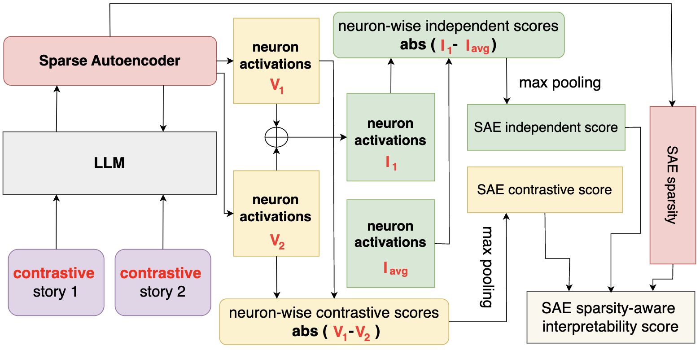
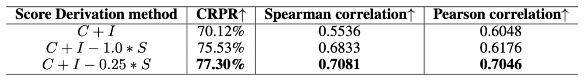
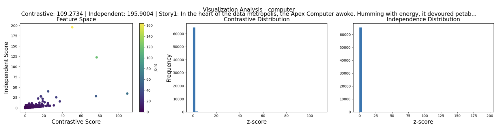

# CE-Bench: A Contrastive Evaluation Benchmark of LLM Interpretability with Sparse Autoencoders

Alex Gulko*, Yusen Peng*, Sachin Kumar

## News

- [Nov 4th, 2025] [paper](https://aclanthology.org/2025.blackboxnlp-1.1) is published on ACL Anthology!
- [October 27th, 2025] [poster](/CE-Bench%20poster%20(84x119cm).pdf) for EMNLP is ready!
- [September 18th, 2025] paper accepted at BlackboxNLP Workshop @ EMNLP, 2025!
- [August 31, 2025] paper available on [arXiv](https://arxiv.org/abs/2509.00691)!
- [May 15, 2025] contrastive story dataset is publicly available on [HuggingFace](https://huggingface.co/datasets/GulkoA/contrastive-stories-v4)!

## Abstract

Sparse autoencoders (SAEs) are a promising approach for uncovering interpretable features in large language models (LLMs). While several automated evaluation methods exist for SAEs, most rely on external LLMs. In this work, we introduce CE-Bench, a novel and lightweight contrastive evaluation benchmark for sparse autoencoders, built on a curated dataset of contrastive story pairs. We conduct comprehensive evaluation studies to validate the effectiveness of our approach. Our results show that CE-Bench reliably measures the interpretability of sparse autoencoders and aligns well with existing benchmarks without requiring an external LLM judge, achieving over 70% Spearman correlation with results in SAEBench. The official implementation and evaluation dataset are made publicly available. 

## CE-Bench



Pipeline of constructing the interpretability metric in CE-Bench. Two contrastive stories about the same subject are passed through a frozen LLM and a pretrained sparse autoencoder (SAE) to extract neuron activations. A contrastive score is computed as the max absolute difference between the stories’ average activations (V1, V2), while an independence score measures deviation from the dataset-wide activation mean (Iavg). These scores, along with SAE sparsity, are used to derive an interpretability score for an LLM-free evaluation of interpretability of sparse autoencoders.


## Alignment Evaluation



Comparison of Interpretability Score Derivation Methods. C stands for contrastive score; I stands for independence score; S stands for sparsity. Baseline achieves 70.12% ranking agreement with SAE-Bench, but the sparsity-aware method pushes it to 77.30% with proper hyperparameter tuning on α.

## Sample Score Visualization



Sample Visualization of Neuron-wise Scores for the Subject “Computer.” The left scatter plot shows each neuron’s contrastive and independence scores, with top-right points indicating neurons that are both highly contrastive and independent. The center and right histograms reveal that most neurons have low scores, suggesting that only a small subset of features are semantically relevant for the given subject.

## Citation

Please cite our work if find it helpful for your research:

```bibtex
@misc{gulko2025cebenchreliablecontrastiveevaluation,
      title={CE-Bench: Towards a Reliable Contrastive Evaluation Benchmark of Interpretability of Sparse Autoencoders}, 
      author={Alex Gulko and Yusen Peng and Sachin Kumar},
      year={2025},
      eprint={2509.00691},
      archivePrefix={arXiv},
      primaryClass={cs.CL},
      url={https://arxiv.org/abs/2509.00691}, 
}
```

## Contacts

If you have any questions or suggestions, feel free to contact:

- Alex Gulko (gulko.5@osu.edu)
- Yusen Peng (peng.1007@osu.edu)
- Sachin Kumar (kumar.1145@osu.edu)

Or describe it in Issues.
