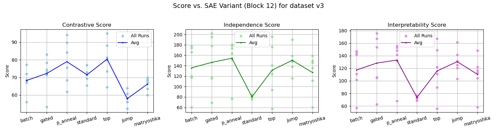
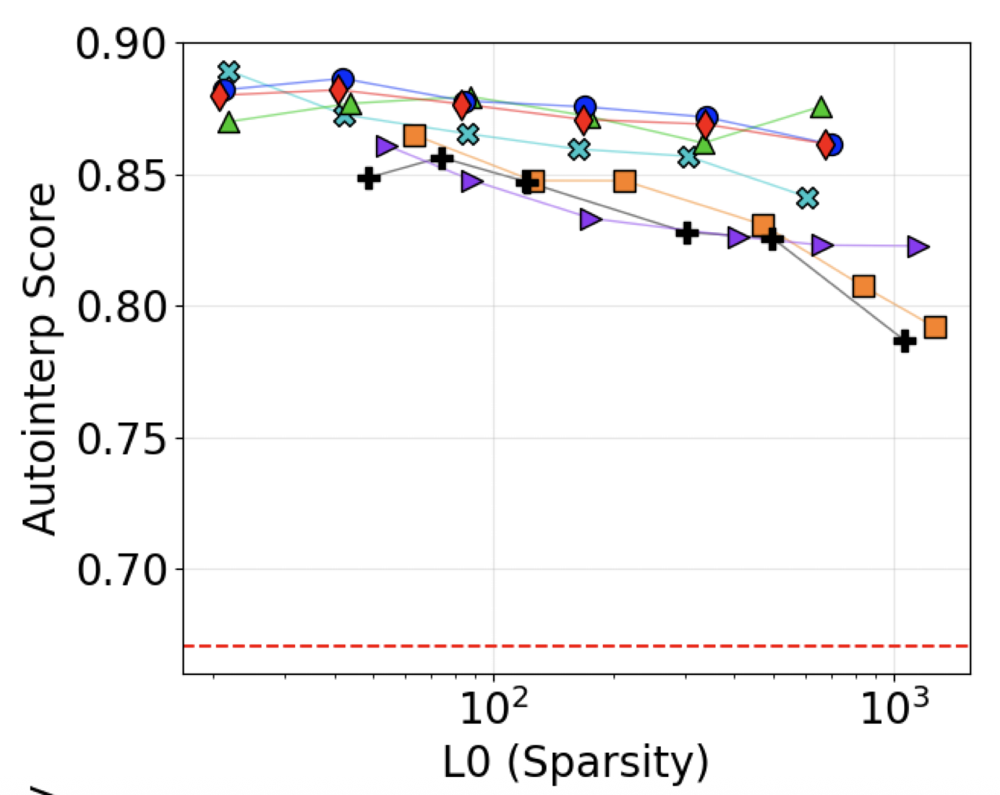
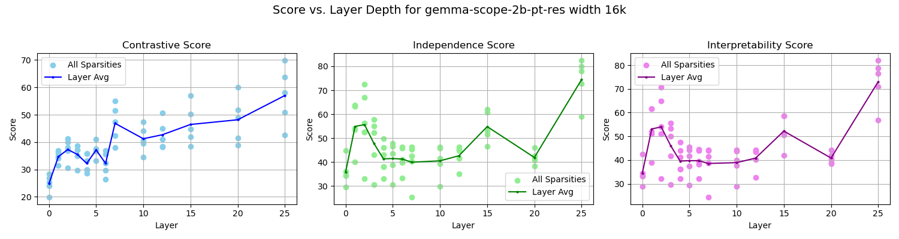
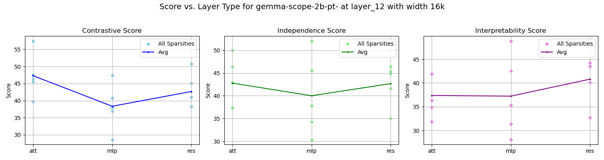
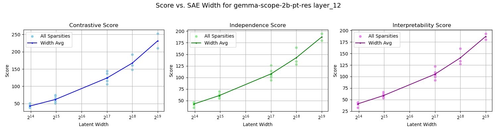

# CE-Bench: A Contrastive Evaluation Benchmark of LLM Interpretability with Sparse Autoencoders

Authors: Alex Gulko, Yusen Peng; Advisor: Dr. Sachin Kumar

## 💥NEW: ICML workshop feedback

1. missing citation - "The paper fails to cite a number of tools and methods it uses, such as the Gemma models, p-annealing SAEs [1], JumpReLUSAEs [2], and others."
2. the flaw of supervised training - "The interpretability score trains a linear regression using SAE-Bench scores as ground truth. However, SAE-Bench itself uses auto-interp as one of its core metrics. CE-Bench therefore inherits whatever noise, bias or prompt-instability those LLM judges introduce, even though its inference stage is LLM-free."
3. missing train/test split - "Since there is no explicit train-test split, one cannot tell whether the proposed metric generalises beyond the SAE-Bench results or merely memorises SAE-Bench results. The authors also never test whether the regressor can predict auto-interp ranking for new SAEs whose SAE-Bench scores are hidden. Without such a holdout, one cannot claim that CE-Bench is a reliable proxy for SAE-Bench."
4. previous work discussion - "the lack of meaningful comparison with relevant previous work, or at least a better positioning of this work with previous work"
5. not agree on the "contrastive part" - "Consider a minimally contrastive example of two stories or concepts like "victory" and "defeat" - intuitively, one would want the features spaces of these two to overlap significantly"
6. a longer discussion and description of the evaluation results is necessary!

## Motivation
The two existing interpretability evaluation methods are based on LLM prompting, which can be inherently nondeterministic, unstable, and inconsistent, despite the fact that we can run the same prompt multiple times to slightly alleviate this problem. Instead of utilizing any LLM to evaluate or simulate neuron activations, we propose a contrastive evaluation framework, CE-Bench. Its architecture is illustrated below:

[alt text](docs/CE_Bench.png)

## Contrastive Dataset
we first constructed a contrastive dataset, consisting of entries each with 3 stories and a subject. Stories are generated synthetically using GPT-4o LLM based on the subject and two prefixes with the prompts specified below.

[alt text](docs/contrastive_dataset.png)

## Contrastive Score
We hypothesize that if neurons activate more differently between tokens with contrastive meanings between two contrastive paragraphs, the latent space is more interpretable. On the left side of the architecture, to implement this, for both input paragraphs, we compute the average activations of all tokens and jointly normalize them as well. We take the absolute element-wise difference of the average activations of two contrastive paragraphs, and we assign the maximum element-wise difference as the contrastive score.

## Independent Score
We also hypothesize that if neurons activate more differently between marked tokens and unmarked tokens regardless of in which paragraph they are, the latent space is more interpretable. On the left side of the architecture, to realize this, for both paragraphs, we compute the average activations of marked tokens and the average activations of unmarked tokens, then jointly normalize them. We take the absolute element-wise difference between the activations of marked tokens and unmarked tokens, and we assign the maximum element-wise difference as the independent score.

## Interpretability Score
we also hypothesize that the simple summation of them can be a naive yet reasonable indicator of the interpretability of sparse autoencoder probing: interpretable neurons, or interpretable sparse autoencoders as a whole, should demonstrate both strong contrastivity and independence.

## Benchmark Result Analysis

### Architecture of Sparse Autoencoders

### our result:

dataset: GulkoA/contrastive-stories-v3
SAE suite: 65k width Gemma-2-2B

### SAEBench result:

SAE suite: 65k width Gemma-2-2B

### Depth of Layers

dataset: GulkoA/contrastive-stories-v2
SAE suite: 16k gemma-scope-2b-pt-res

### Type of Layers

### our result (preliminary)

dataset: GulkoA/contrastive-stories-v1
SAE suite: gemma-scope-2b-pt at layer 12, 16k width

### Width of Latent Space

### our result (preliminary):

dataset: GulkoA/contrastive-stories-v2
SAE suite: 16k gemma-scope-2b-pt-res at layer 12

## command zoo

cores python ce_bench/CE_Bench.py --sae_regex_pattern "gemma-scope-2b-pt-res" --sae_block_pattern "layer_12/width_16k/average_l0_.*"

cores python ce_bench/neuron_steering.py
